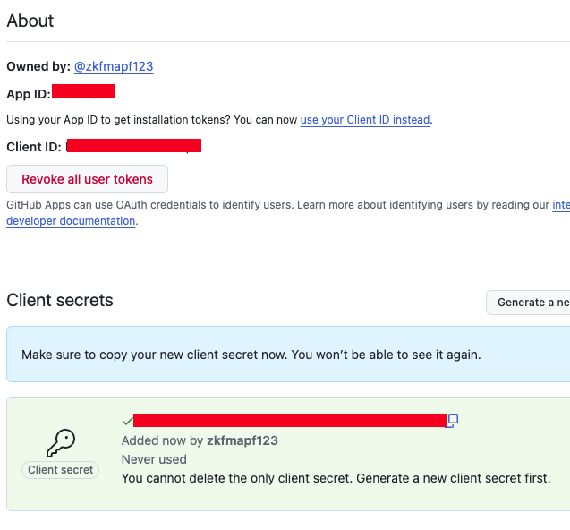
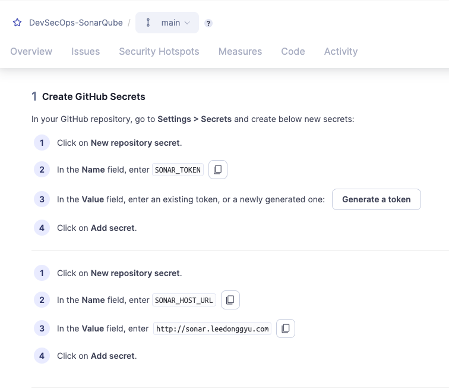

# SonarQube 구축

## 세부 요구사항

- [ ] 특정 폴더 / 파일 포함 or 제외
- [ ] 모노레포 구성 
- [x] Matrix (반복적 처리)

```sh
jobs:
  sonar-scan:
    name: Analyze ${{ matrix.name }} Project
    runs-on: ubuntu-latest
    strategy:
      matrix:
        include:
          - name: Java
            path: apis/java
            key: apis-java
          - name: TypeScript
            path: apis/ts
            key: apis-ts

    steps:
      - uses: actions/checkout@v4
        with:
          fetch-depth: 0

      - name: SonarQube Scan
        uses: SonarSource/sonarqube-scan-action@v4
        with:
          args: >
            -Dsonar.projectKey=${{ matrix.key }}
            -Dsonar.projectName=APIs - ${{ matrix.name }}
            -Dsonar.sources=src
            -Dsonar.projectBaseDir=${{ matrix.path }}
        env:
          SONAR_TOKEN: ${{ secrets.SONAR_TOKEN }}
          SONAR_HOST_URL: ${{ secrets.SONAR_HOST_URL }}
```


## Github Apps 만들기

### 1. Apps 만들기
- homepage URL : https://sonarqube-domain
- callback URL : https://sonarqube-domain/oauth2/callback/github
- webhook URL : https://sonarqube-domain/github-webhook/

```sh
- Repository Permissions
    - Checks -> Read / Writer
    - Metadata -> Read-only
    - Pull requests -> Read / Write
    - Comit Status -> Read-only
- Any Account
```

### 2. Private Key 발급받기

- SoanrQube랑 연동할때 필요한것
    - App ID
    - Client ID
    - Private Key
    - Webhook Secret




## 소나큐브 설정

- 
- 
- 

### SonarQube Github 설정 구성 
#### Enterpsise -> https://github.company.com/api/v3
#### Other -> https://api.github.com/

## 소나큐브 프로젝트 등록

- project root 에 sonar-project.properties 파일 생성

[sonar-project.properties](./sonar-project.properties)

```sh
    Secret 등록
    - SONAR_TOKNE
    - SONAR_HOST_URL
```

- 

## 소나 Lint 적용해서 Local 에서 실행하기
