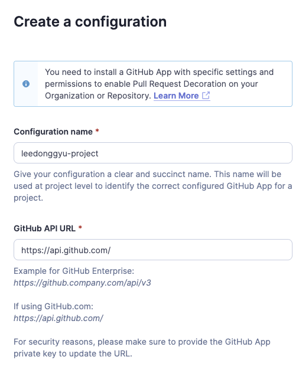

# SonarQube 구축

## Github 적용

### 소나큐브 접속


### SonarQube Github 설정 구성 
#### Enterpsise -> https://github.company.com/api/v3
#### Other -> https://api.github.com/


### Github Apps 만들기


### Github Apps 만들기-2
#### Homepage / Callback / Webhook URL 동일


### App Install 하기


### Private Key 생성


## Github Apps 설정 시, Repository Permissin

```sh
- Repository Permissions
    - Checks -> Read / Writer
    - Metadata -> Read-only
    - Pull requests -> Read / Write
    - Comit Status -> Read-only
- Any Account
```