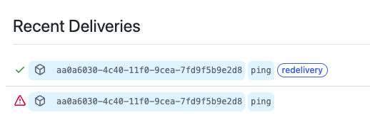

# SonarQube 구축

## Github Apps 만들기

### 1. Apps 만들기
- homepage URL : https://sonarqube-domain
- callback URL : https://sonarqube-domain/oauth2/callback/github
- webhook URL : https://sonarqube-domain/github-webhook/

```sh
- Repository Permissions
    - Checks -> Read / Writer
    - Metadata -> Read-only
    - Pull requests -> Read / Write
    - Comit Status -> Read-only
- Any Account
```

### 2. Private Key 발급받기

- SoanrQube랑 연동할때 필요한것
    - App ID
    - Client ID
    - Private Key
    - Webhook Secret


## 소나큐브 설정

- 
- 
- 


### SonarQube Github 설정 구성 
#### Enterpsise -> https://github.company.com/api/v3
#### Other -> https://api.github.com/
